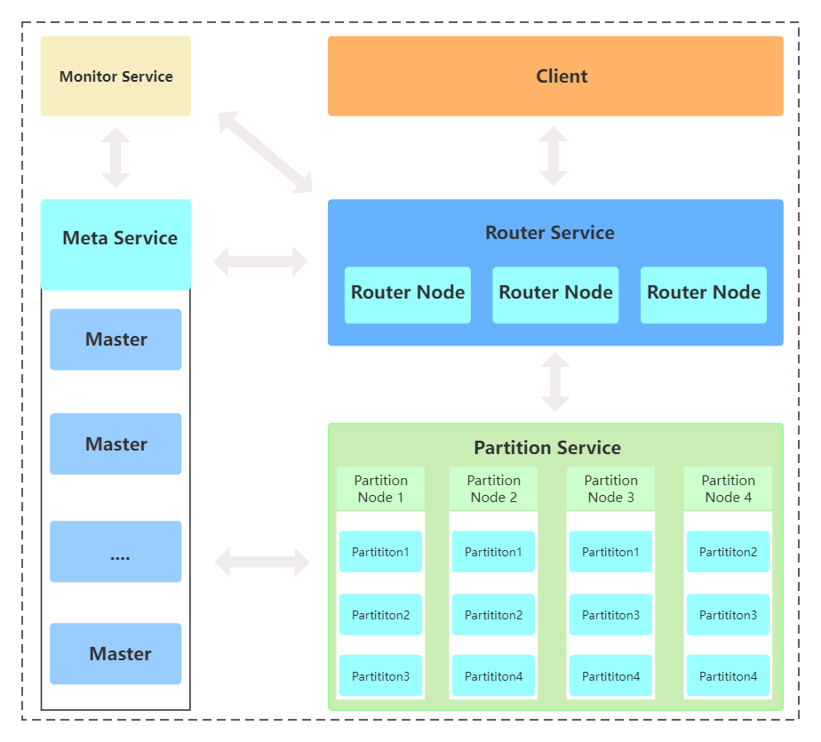
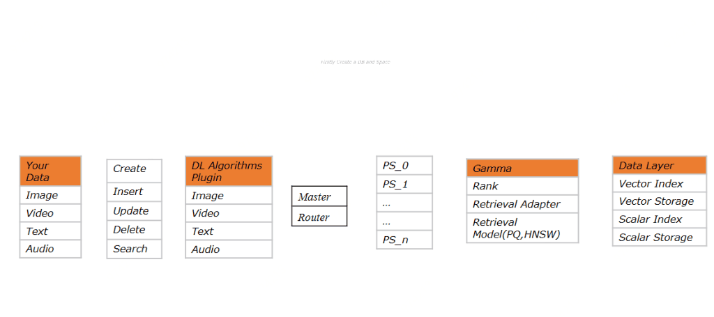

<div align="center">
  
</div>

[](https://github.com/vearch/vearch/actions/workflows/CI.yml)  &nbsp;&nbsp;&nbsp; [](https://gitter.im/vector_search/community?utm_source=badge&utm_medium=badge&utm_campaign=pr-badge)
## Overview

Vearch is a scalable distributed system for efficient similarity search of deep learning vectors. 

## Document

* [English](https://vearch.readthedocs.io/en/latest) | [中文](https://vearch.readthedocs.io/zh_CN/latest)

## Quick start

### Install Vearch

#### [Deploy vearch cluster on k8s](https://vearch.github.io/vearch-helm/)
Add charts through the repo
```
$ helm repo add vearch https://vearch.github.io/vearch-helm
$ helm repo update && helm install my-release vearch/vearch
```
Add charts from local
```
$ git clone https://github.com/vearch/vearch-helm.git
$ cd vearch-helm
$ make && helm install my-release ./charts -f ./charts/values.yaml
```

#### Start by docker-compose
```
$ cd cloud
$ cp ../config/config.toml.example config.toml
$ docker-compose up
```

#### Compile by source code
Quickly compile the source codes to build a distributed vector search system with RESTful API, please see [SourceCompileDeployment.md](docs/SourceCompileDeployment.md).

#### Deploy a visual search system
Vearch can be leveraged to build a complete visual search system to index billions of images. The image retrieval plugin for object detection and feature extraction is also required. For more information, please refer to [Quickstart.md](docs/Quickstart.md).

#### Use python sdk
Vearch Python SDK enables vearch to use locally. Vearch python sdk can be installed easily by pip install vearch. For more information, please refer to [APIPythonSDK.md](engine/sdk/python/docs/APIPythonSDK.md).

## APIs and Use Cases


### LowLevelAPI
* [APILowLevel.md](docs/APILowLevel.md)
* For GPU [APILowLevel.md](docs/APILowLevelOnGPU.md)


### VisualSearchAPI
* [APIVisualSearch.md](docs/APIVisualSearch.md)

### PythonSDKAPI
* [APIPythonSDK.md](engine/sdk/python/docs/APIPythonSDK.md)

## Components

<details>
  <summary><b>Vearch Architecture</b></summary>



</details>

<details>
  <summary><b>Master</b></summary>
  Responsible for schema mananagement, cluster-level metadata, and resource coordination. 
</details>

<details>
  <summary><b>Router</b></summary>
  Provides RESTful API: `create`  , `delete`  `search` and `update` ; request routing, and result merging. 
</details>

<details>
  <summary><b>PartitionServer (PS)</b></summary>
  Hosts document partitions with raft-based replication.

  Gamma is the core vector search engine implemented based on [faiss](https://github.com/facebookresearch/faiss). It provides the ability of storing, indexing and retrieving the vectors and scalars.
</details>

## Benchmarks

* [benchmarks](benchs/README.md)

## Demo

## Reference
Reference to cite when you use Vearch in a research paper:
```
@misc{li2019design,
      title={The Design and Implementation of a Real Time Visual Search System on JD E-commerce Platform}, 
      author={Jie Li and Haifeng Liu and Chuanghua Gui and Jianyu Chen and Zhenyun Ni and Ning Wang},
      year={2019},
      eprint={1908.07389},
      archivePrefix={arXiv},
      primaryClass={cs.IR}
}
```

## Community
You can report bugs or ask questions in the [issues page](https://github.com/vearch/vearch/issues) of the repository.

For public discussion of Vearch or for questions, you can also send email to vearch-maintainers@groups.io.

Our slack : https://vearchwrokspace.slack.com

## Known Users
Welcome to register the company name in this issue: https://github.com/vearch/vearch/issues/230 (in order of registration)

欢迎在此 issue https://github.com/vearch/vearch/issues/230 中登记公司名称


## License

Licensed under the Apache License, Version 2.0. For detail see [LICENSE and NOTICE](https://github.com/vearch/vearch/blob/master/LICENSE).
