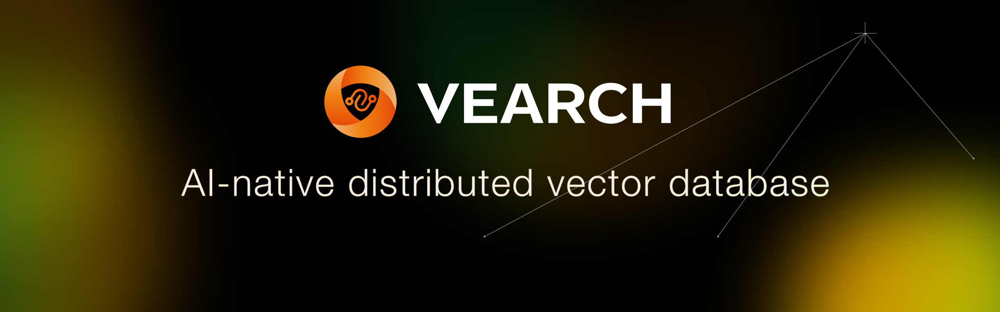
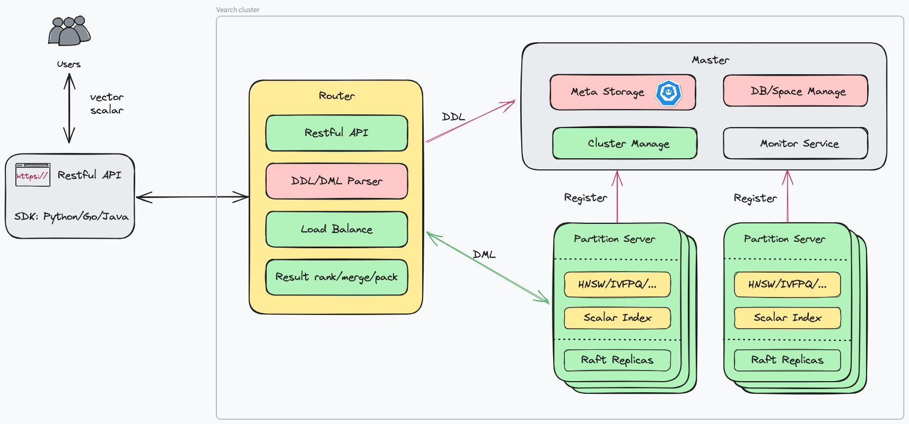

<div align="center">
  
  <p>
    <a href="https://github.com/vearch/vearch/blob/master/README_ZH_CN.md">简体中文</a> | <a href="https://github.com/vearch/vearch/blob/master/README.md">English</a>
  </p>
</div>


[](./LICENSE)
[](https://github.com/vearch/vearch/actions/workflows/CI.yml)
[](https://gitter.im/vector_search/community?utm_source=badge&utm_medium=badge&utm_campaign=pr-badge)
## Overview

Vearch is a cloud-native distributed vector database for efficient similarity search of embedding vectors in your AI applications. 

## Key features

-  **Hybrid search**: Both vector search and scalar filtering.

- **Performance**: Fast vector retrieval - search from millions of objects in milliseconds. 

- **Scalability & Reliability**: Replication and elastic scaling out. 


## Document

* [Tutorial](https://vearch.readthedocs.io/en/latest)

## Quick start

**[Deploy vearch cluster on k8s](https://vearch.github.io/vearch-helm/)**

**Add charts through the repo**
```
$ helm repo add vearch https://vearch.github.io/vearch-helm
$ helm repo update && helm install my-release vearch/vearch
```
**Add charts from local**
```
$ git clone https://github.com/vearch/vearch-helm.git && cd vearch-helm
$ helm install my-release ./charts -f ./charts/values.yaml
```

**Start by docker-compose**
```
$ cd cloud
$ cp ../config/config.toml .
$ docker-compose up
```

**Deploy by docker**: Quickly start with vearch docker image, please see [DeployByDocker](docs/DeployByDocker.md)

**Compile by source code**: Quickly compile the source codes, please see [SourceCompileDeployment](docs/SourceCompileDeployment.md)


## APIs and Use Cases

**VisualSearch**: Vearch can be leveraged to build a complete visual search system to index billions of images. The image retrieval plugin for object detection and feature extraction is also required. For more information, please refer to [Quickstart.md](docs/Quickstart.md).

**PythonSDK**: [APIPythonSDK.md](internal/engine/sdk/python/docs/APIPythonSDK.md)
Vearch Python SDK enables vearch to use locally. Vearch python sdk can be installed easily by pip install vearch.

## Components

**Vearch Architecture**



**Master**: Responsible for schema mananagement, cluster-level metadata, and resource coordination. 

**Router**: Provides RESTful API: `upsert`, `delete`, `search` and `query`; request routing, and result merging.

**PartitionServer (PS)**: Hosts document partitions with raft-based replication. Gamma is the core vector search engine implemented based on [faiss](https://github.com/facebookresearch/faiss). It provides the ability of storing, indexing and retrieving the vectors and scalars.

## Reference
Reference to cite when you use Vearch in a research paper:
```
@misc{li2019design,
      title={The Design and Implementation of a Real Time Visual Search System on JD E-commerce Platform}, 
      author={Jie Li and Haifeng Liu and Chuanghua Gui and Jianyu Chen and Zhenyun Ni and Ning Wang},
      year={2019},
      eprint={1908.07389},
      archivePrefix={arXiv},
      primaryClass={cs.IR}
}
```

## Community
You can report bugs or ask questions in the [issues page](https://github.com/vearch/vearch/issues) of the repository.

For public discussion of Vearch or for questions, you can also send email to vearch-maintainers@groups.io.

Our slack : https://vearchwrokspace.slack.com

## Known Users
Welcome to register the company name in this issue: https://github.com/vearch/vearch/issues/230 (in order of registration)


## License

Licensed under the Apache License, Version 2.0. For detail see [LICENSE and NOTICE](https://github.com/vearch/vearch/blob/master/LICENSE).
