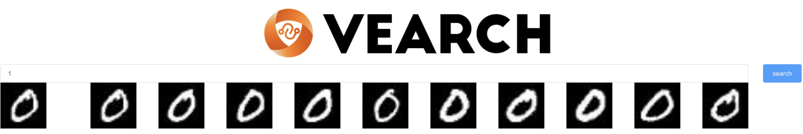

# MNIST image search
A simple image neural search demo for MNIST. No extra dependencies needed, simply run:
```shell
docker run -it -p 8812:8812 --env "WEB_PORT=8812" --name vearch-demo   gdream/vearch-demo:latest
```

```shell
$ docker run -it -p 8812:8812 --env "WEB_PORT=8812" --name vearch-demo   gdream/vearch-demo:latest


██╗   ██╗███████╗ █████╗ ██████╗  ██████╗██╗  ██╗
██║   ██║██╔════╝██╔══██╗██╔══██╗██╔════╝██║  ██║
██║   ██║█████╗  ███████║██████╔╝██║     ███████║
╚██╗ ██╔╝██╔══╝  ██╔══██║██╔══██╗██║     ██╔══██║
 ╚████╔╝ ███████╗██║  ██║██║  ██║╚██████╗██║  ██║
  ╚═══╝  ╚══════╝╚═╝  ╚═╝╚═╝  ╚═╝ ╚═════╝╚═╝  ╚═╝
                                                 

------------ [vearch]: starting 
------------ [vearch]: start success 
------------ create db[mnist] success, resp: {"code":200,"msg":"success","data":{"id":1,"name":"mnist"}} 
------------ create space[mnist] success, resp: {"code":200,"msg":"success","data":{"id":1,"name":"mnist","version":2,"db_id":1,"enabled":true,"partitions":[{"id":1,"space_id":1,"db_id":1,"partition_slot":0,"replicas":[1]}],"partition_num":1,"replica_num":1,"properties":{"feature": {"type": "vector", "dimension": 64, "format": "normalization"}},"engine":{"index_size":10000,"metric_type":"InnerProduct","retrieval_type":"IVFPQ","retrieval_param":{"metric_type": "InnerProduct", "ncentroids": 256, "nsubvector": 32}},"space_properties":{"feature":{"field_type":5,"type":"vector","format":"normalization","dimension":64,"option":1}}}} 
Downloading http://yann.lecun.com/exdb/mnist/train-images-idx3-ubyte.gz to ./mnist/train-images-idx3-ubyte.gz
Extracting ./mnist/train-images-idx3-ubyte.gz to ./mnist/
Downloading http://yann.lecun.com/exdb/mnist/train-labels-idx1-ubyte.gz to ./mnist/train-labels-idx1-ubyte.gz
Extracting ./mnist/train-labels-idx1-ubyte.gz to ./mnist/
------------ Begin insert data 
------------ insert complete num: 0, resp: <Response [200]> 
------------ insert complete num: 1000, resp: <Response [200]> 
------------ [vearch]:  App running at:
    - Network::   http://172.17.0.4:8812/ 
    - Local:   http://localhost:8812/  
```

This downloads the MNIST training and test dataset, choose 1000 train data extract feature and insert into vearch, then you can retrieve relevant results by http://localhost:8812/ . 
**NOTICE**: If you change the port mapping of the container, remember to modify the port of the service synchronously. 

